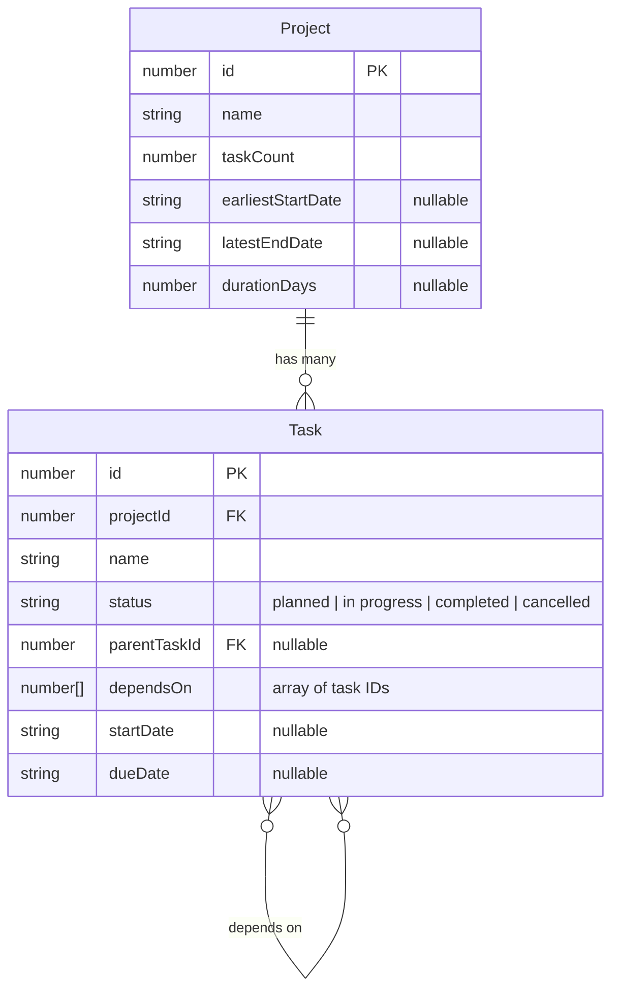

# Stack
- React Front End
- Use Typescript
- Vite
- Tailwind CSS

# Interview Problem (Frontend): Project Management
 
## Context
 
- Our company goal is to develop mineral extraction projects more efficiently than our peers without compromising on quality and safety.
- Our team of process engineers and project developers uses a combination of industry standard software and in-house custom software designed to integrate with, streamline, and fill in the gaps of standard software.
- To that end, one of the many things we find ourselves doing is integrating different project management tools, and providing project schedule insights which are otherwise unavailable.
 
### Common User Problems
 
- "What is task X connected to? If task X is delayed, what other tasks will be delayed?"
- "What's supposed to happen in the next two weeks?"
  - _related: What's the weather looking like for those two weeks? I'll need to reschedule concrete pouring if it will rain..._
- "What are all the tasks which lead up to task Y?"
 
## Goals
 
We're going to engage in an exercise of rapid prototyping against a simple management service with the following goals:
 
1. Develop views (1) to list projects and (2) view the listing of tasks for a chosen project
2. Refine your initial app to address some user needs.
   - _Note: Today we're more interested in viewing complex data in a variety of ways than in creating, modifying, or deleting it_
 
We're hoping to see you demonstrate experience with web application design and software engineering by sharing your thought process.
 
## Instructions
 
- Work with tools of your choice and share your full screen during the interview
  - _Note: We'll record the session for memory's sake and for improving our process._
- Before ending the interview, zip up the files and share them with your interviewer via link. Do not send them as an email attachment.
- This interview is fully open book, with use of AI coding tools fully encouraged as long as you show your process.
- You may be expected to explain any of the AI code you accept.
 
## Task Management API
 
- Available via ngrok at an address provided by your interviewer
  - API will be available via ngrok at an address such as like `https://{TUNNEL_ID}.ngrok-free.app`
  - API docs will be available at `https://{TUNNEL_ID}.ngrok-free.app/api-docs/swagger`
  - JSON formatted API docs will be available at `https://{TUNNEL_ID}.ngrok-free.app/api-docs`
- The task management service is preloaded with example data
- No authentication is needed
 
### Data Model
 
The task management service uses the following entity structure:
 

 
**Key Relationships:**
 
- A `Project` can have many `Task`s
- A `Task` belongs to one `Project` (via `projectId`)
- A `Task` can have a parent `Task` (via `parentTaskId`) for hierarchical organization
- A `Task` can depend on multiple other `Task`s (via `dependsOn` array) for dependency tracking
 
## Optional Resources

You don't need to engage with the following links in order to successfully complete this interview, but you may find them useful.

- [Gantt chart](https://en.wikipedia.org/wiki/Gantt_chart)
  - One of many project management visualizations our users are familiar with.
- [Critical Path Method](https://en.wikipedia.org/wiki/Critical_path_method)
  - An approach to scheduling or analyzing complex projects with dependencies.
- [Open Meteo](https://open-meteo.com/)
  - A free weather API

---

## Implementation Plan

### **Phase 1: Foundation Setup**

1. **Project Initialization**
   - Initialize Vite project with React and TypeScript template
   - Install and configure Tailwind CSS
   - Set up project structure (components, services, types, utils folders)
   - Configure environment variables for API base URL

2. **Type Definitions & API Client**
   - Define TypeScript interfaces for Project and Task entities
   - Create API service layer with fetch methods for:
     - GET /projects (list all projects)
     - GET /projects/:id (get project details)
     - GET /projects/:id/tasks (get tasks for a project)
     - GET /tasks/:id (get task details)
   - Add error handling and loading states

3. **Routing Setup**
   - Install React Router
   - Create routes: `/` (projects list) and `/projects/:id` (task list)
   - Add navigation components

### **Phase 2: Core Views**

4. **Projects List View**
   - Display all projects with key metrics (name, task count, dates, duration)
   - Add clickable cards/rows to navigate to task view
   - Show summary statistics (earliest start, latest end date)

5. **Tasks List View**
   - Display tasks for selected project
   - Show task status, dates, and basic info
   - Add visual indicators for status (planned/in progress/completed/cancelled)

### **Phase 3: Advanced Features (Addressing User Needs)**

6. **Task Dependency Visualization**
   - Show what tasks depend on task X (downstream/blocking)
   - Show what task X depends on (upstream/prerequisites)
   - Visual flow diagram or tree structure
   - *Addresses: "What is task X connected to? If delayed, what gets affected?"*

7. **Timeline View (Next 2 Weeks)**
   - Calendar/timeline view filtering tasks by date range
   - Show upcoming tasks in chronological order
   - Group by date or week
   - *Addresses: "What's supposed to happen in the next two weeks?"*

8. **Critical Path Analysis**
   - Recursive function to find all prerequisite tasks for task Y
   - Visual representation of the dependency chain
   - Show the path from project start to target task
   - *Addresses: "What are all the tasks which lead up to task Y?"*

9. **Enhanced UX Features**
   - Search and filter tasks by name, status, date range
   - Sorting options (by date, status, name)
   - Task hierarchy view showing parent-child relationships
   - Responsive design for different screen sizes

10. **Polish & Testing**
    - Add loading states and error handling
    - Improve visual design with Tailwind
    - Test with API data
    - Ensure smooth navigation and interactions

### **Key Technical Considerations:**

- **Dependency Graph Logic**: Build adjacency lists for efficient traversal
- **Date Handling**: Parse ISO date strings, filter by date ranges
- **Performance**: Memoize expensive calculations (dependency trees)
- **State Management**: Use React hooks (useState, useEffect) or consider Context API for shared state

Task Management API
Reference: `api-spec.json`

PATH: https://897d77d8e056.ngrok-free.app

GET
/projects
List all projects

POST
/projects
Create a new project

GET
/projects/{id}
Get project by ID

PUT
/projects/{id}
Update project

DELETE
/projects/{id}
Delete project

Tasks

GET
/projects/{id}/tasks
List all tasks for a project

POST
/projects/{id}/tasks
Create a new task

GET
/projects/{id}/tasks/{taskId}
Get task by ID

PUT
/projects/{id}/tasks/{taskId}
Update task

DELETE
/projects/{id}/tasks/{taskId}
Delete task

# User Interface Experience

- Use Tailwind
- Make it look awesome

# Use Case

- The customer should be able view their schedule and look at their dependent tasks
- Show GANT chart in the UI

